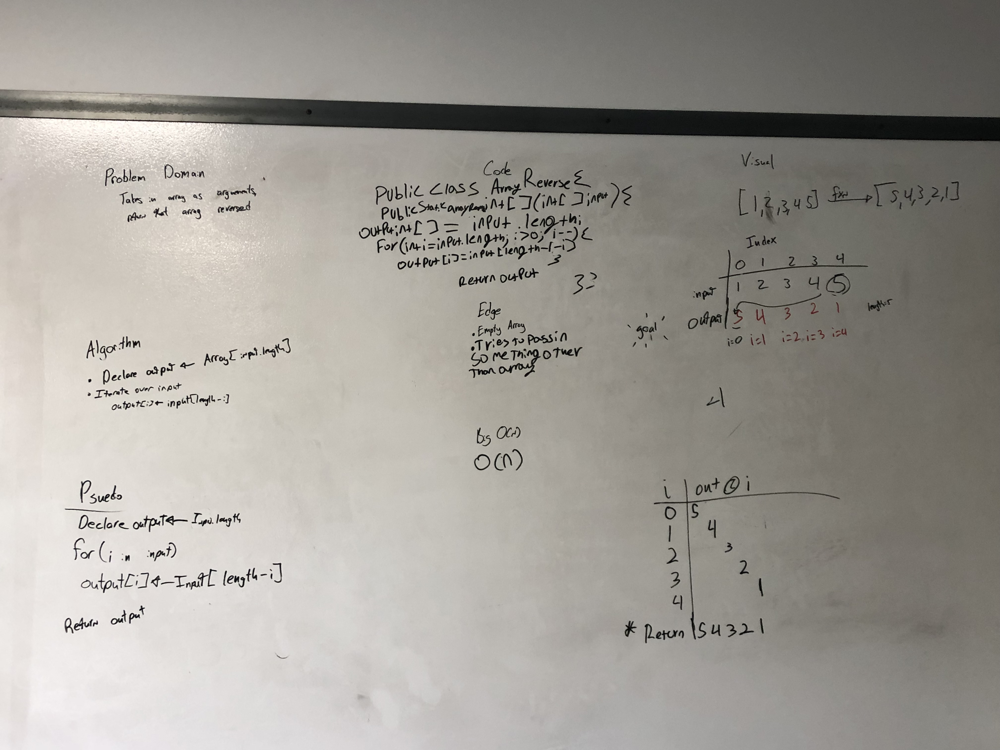

# data-structures-and-algorithms

[301](code-challanges/301)

[401](code-challanges/401)
  [ArrayReverse](code-challanges/401/ArrayReverse.java)
  
    Array Reverse was a whiteboard code challenge sketched out with Michael Jhans and brought to life with extensive assistance from Jessica Lovell.